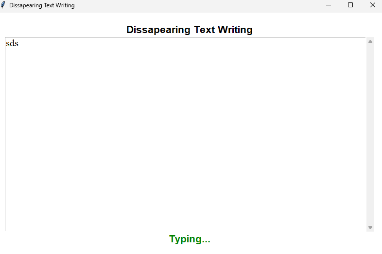
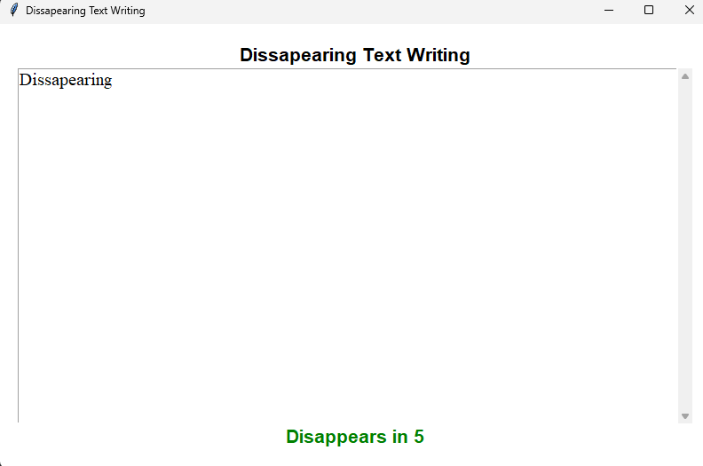

## 📝 Disappearing Text Writing App

- A minimalistic productivity application built with Python & Tkinter that automatically clears the text if the user stops typing for 5 seconds.

- This project demonstrates event-driven programming, time-based logic, and separation of concerns between UI and business logic.

## 🚀 Features
- ⌨️ Real-time typing detection
- ⏳ 5-second inactivity countdown
- 🧠 Engine-based time calculation using time.monotonic()
- 🔁 Automatic text deletion after inactivity
- 🧱 Clean separation between UI and logic (ui.py + engine.py)
- 🎯 Event-driven architecture using Tkinter's after() scheduling

## 🏗 Project Structure
- disappearing-text-app/
- │
- ├── main.py
- ├── ui.py
- ├── engine.py
- └── README.md

## 📷 Application Preview

## 🧠 How It Works

- Every key release triggers engine.on_activity()
- The engine stores the current timestamp using time.monotonic()
- A recurring update_countdown() loop runs every second
- The engine calculates:
remaining = timeout - (current_time - last_activity)
- When remaining <= 0:
- The text is cleared
- The app returns to idle state

- The countdown is based on real elapsed time, not simple decrementing ticks, ensuring precise 5-second inactivity behavior.

## 📚 What I Learned

- Event-driven GUI development
- Using after() for scheduling
- Time-based state management
- Designing clean return contracts between components
- Separating UI from logic
- Building robust inactivity detection systems

## 📌 Future Improvements

- Add configurable timeout duration
- Add dark mode
- Handle paste / cut events
- Add visual countdown animation
- Add settings panel