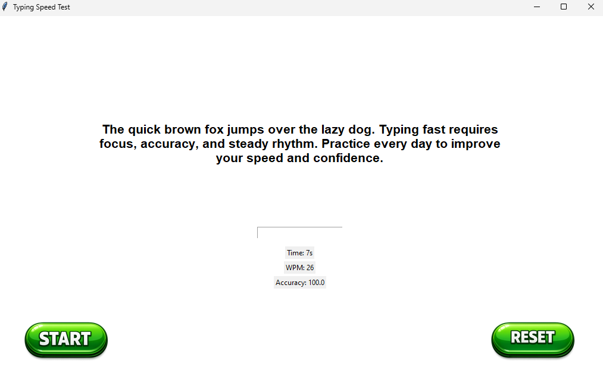

# ⌨️ Typing Speed Test – Python Tkinter GUI

A desktop **Typing Speed Test** application built with **Python** and **Tkinter**, focused on clean architecture, event-driven programming, and separation of concerns between UI and logic.

This project was built during the *100 Days of Code – Python* course and extended beyond the course requirements to reflect real software engineering practices.

---

## 🚀 Features

- Real-time timer using Tkinter `after()`
- Word-by-word validation triggered on **Space key**
- Live calculation of:
  - **WPM (Words Per Minute)**
  - **Accuracy (%)**
- Proper handling of punctuation (`dog.` vs `dog`)
- Input protection when test is not started
- Clean reset and restart flow
- Simple and intuitive GUI

---

## 🧠 Architecture

The project is intentionally split into two layers:
- ui.py - Tkinter GUI, events, timer, user interaction
- engine.py - Pure logic: text processing, word validation, normalization

This separation allows the UI to remain “dumb” while all logic is handled by the engine.

---

## 🛠️ Technical Concepts Used

This project demonstrates understanding of:

- Event-driven programming (`bind`, `after`)
- State management inside GUI applications
- Separation of concerns (UI vs Logic)
- Handling edge cases and input validation
- String normalization and punctuation handling
- OOP design in Python

---

## 📷 Application Preview

## 🧩 Word Normalization

- The engine compares words after removing punctuation and normalizing case, so the following are treated as equal:
Dog == dog == dog. == DOG,
