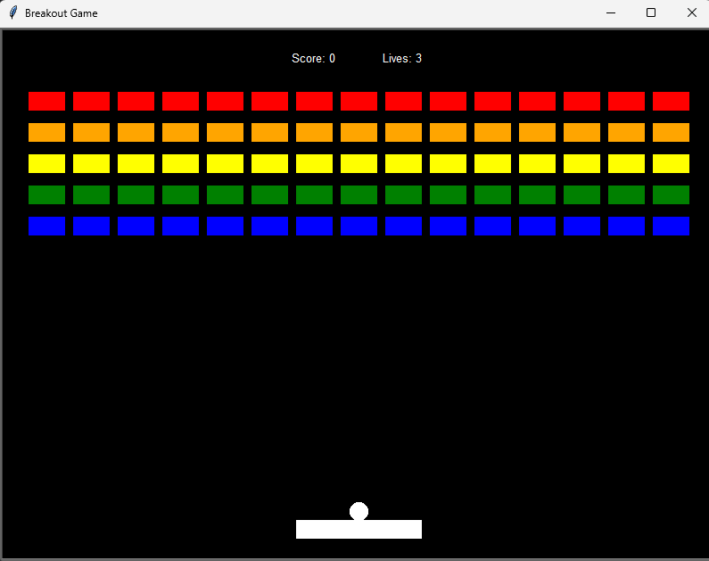

# 🧱 Breakout Game – Python (Turtle OOP)

A classic **Breakout arcade game** implemented in Python using the Turtle graphics module, built with an object-oriented design.

This project was created as part of **Day 87 – Personal Portfolio Project** from Angela Yu’s *100 Days of Code*, but fully extended and structured beyond the course requirements.

---

## 🎮 Gameplay

- The ball starts attached to the paddle
- Press **Space** to release the ball
- Break all the blocks to win
- You have **3 lives**
- The ball speeds up each time it hits the paddle
- Score and lives are displayed at the top of the screen

---

## 🧠 Architecture (OOP Design)

The project is split into multiple modules, each with a clear responsibility:

| File | Responsibility |
|-----|-----------------|
| `screen.py` | Game window setup and key bindings |
| `paddle.py` | Player paddle movement and limits |
| `ball.py` | Ball movement, bounce logic, and paddle follow |
| `block.py` | Individual breakable blocks |
| `scoreboard.py` | Score, lives, and game messages |
| `main.py` | Game loop, collision logic, and game state |

This separation keeps the game logic clean and scalable.

---

## 🖼️ Screenshot

---

## 🚀 Features

- Smooth animation using `tracer(0)` and manual updates
- Accurate collision detection with:
  - Walls
  - Paddle
  - Blocks
- Ball attaches to paddle until Space is pressed
- Increasing difficulty (ball speed increases)
- Win and Game Over screens
- Row-colored block grid (classic arcade style)

---

## 🛠️ Technologies Used

- Python 3
- Turtle Graphics
- Object-Oriented Programming (OOP)

---

## 📚 What I Learned

- Designing a multi-file OOP project from scratch
- Handling real-time game loops
- Managing state and events (keyboard input)
- Collision detection and game mechanics
- Clean separation of responsibilities across modules

