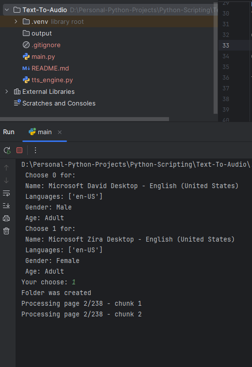

# 📚 PDF to Audio Converter (Offline)

A simple Python tool that converts PDF files into audio (WAV) using offline text-to-speech.

This project extracts text from a PDF file, splits it into manageable chunks, and generates audio files using `pyttsx3`.

No API keys. No billing. Fully offline.

---

## 🚀 Features

- ✅ Extract text from PDF files
- ✅ Automatic text chunking for large pages
- ✅ Convert text to WAV audio
- ✅ Voice selection
- ✅ Custom rate and volume
- ✅ Automatic `output/` folder creation
- ✅ Progress display during processing
- ❌ Does NOT support scanned (image-based) PDFs

---

## 🛠️ Technologies Used

- Python 3
- `pypdf` (PDF text extraction)
- `pyttsx3` (Offline TTS engine)
- `tkinter` (File picker)
- `pathlib` (File management)

---

## output/
- │
- ├── page_001_chunk_01.wav
- ├── page_001_chunk_02.wav
- ├── page_002_chunk_01.wav
- ...

## 📸 Screenshot

## ⚙️ Configuration

- You can modify:
- `MAX_CHARS = 2500` to change the chunk size.

### You can also adjust:

- Speech rate
- Volume
- Voice selection

## ⚠️ Limitations

- Scanned PDFs (image-based) are not supported.
- Large PDFs may take significant time to process (real-time TTS generation).
- Output format is WAV (MP3 conversion not included).

---

## 💡 Future Improvements

- CLI arguments support
- MP3 conversion
- Resume capability
- GUI interface with progress bar
- Smarter sentence-based chunking

---

## 🎯 Why This Project?

This project demonstrates:

- File handling
- Modular architecture
- Input validation
- Batch processing
- Text chunking
- Integration of external libraries
- Clean project structure

---

## 📌 Author

**Sorin Fulger**

