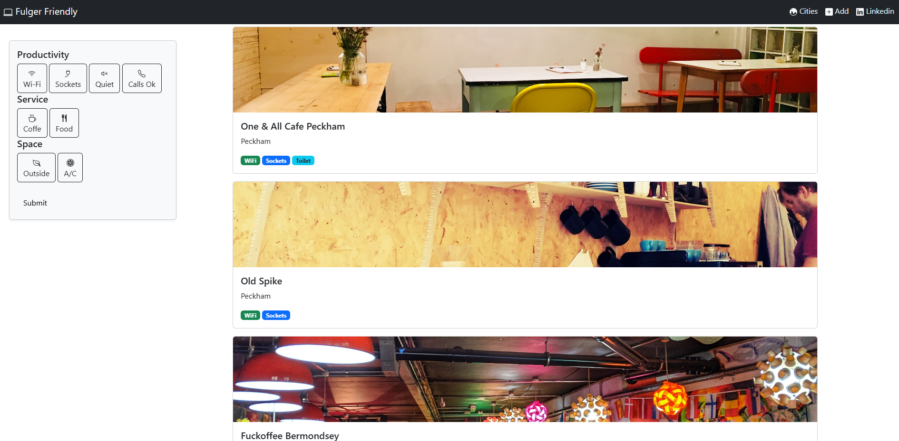

# ☕ Wifi & Coffee

A full-stack web application for discovering cafés that are **work-friendly** — good Wi-Fi, power sockets, quiet spaces, and proper coffee ☕💻.

Built from scratch using **Flask**, **SQLAlchemy**, **Bootstrap 5**, and **Jinja2**, this project focuses on real-world layout, filtering logic, and clean data flow between frontend and backend.

---

## ✨ Features

- 📋 Browse a list of cafés stored in a database
- 🖼️ Image-based café cards with clean layout
- 🧠 Visual indicators (badges) for:
  - Wi-Fi availability
  - Power sockets
  - Quiet spaces
  - Calls allowed
- 🎛️ Sticky filter sidebar (UX-oriented design)
- 🗄️ SQLite database with SQLAlchemy ORM
- 🔄 Full backend → frontend data rendering
- 🧩 Modular templates with Jinja2

---

## 🛠️ Tech Stack

**Backend**
- Python
- Flask
- Flask-SQLAlchemy
- Flask-WTF
- SQLite

**Frontend**
- HTML5
- Bootstrap 5
- Jinja2 templates

---

## 📁 Project Structure

- ├── app.py
- ├── cafes.db
- ├── templates/
- │ ├── base.html
- │ ├── index.html
- │ ├── add.html
- ├── static/
- │ ├── css/
- │ └── images/
- └── README.md

## 🧪 Database Model (Cafe)
Each café includes:
- Name
- Location
- Image URL
- Google Maps link
- Seats info
- Boolean features:
- Wi-Fi
- Sockets
- Toilet
- Calls allowed
- Coffee price

## 🎯 Project Goals

This project was built to:

- Move beyond tutorial-based coding
- Practice real layout & UX decisions
- Understand full data flow (DB → backend → frontend)
- Gain confidence building a complete web app

## 📸 Screenshots

## 🔮 Future Improvements

- Filter cafés based on selected features
- Pagination / infinite scroll
- Edit & delete cafés
- Authentication (admin panel)
- Deployment (Render / Fly.io / Railway)

## 👤 Author

- Sorin Fulger
- Built with focus, frustration, and a lot of coffee ☕
- 2025