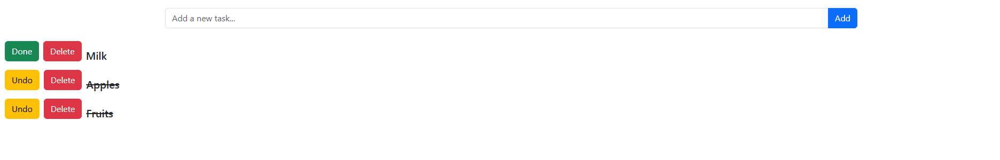

# 📝 To-Do List Web App (Flask)

A simple and clean **To-Do List web application** built from scratch using **Flask**, **Flask-WTF**, **SQLAlchemy**, and **Bootstrap**.  
The project focuses on understanding the full flow of a backend-driven web app: forms, database persistence, routing, and UI polish.

---

## ✨ Features

- ➕ Add new tasks
- ✅ Mark tasks as done / undone
- ❌ Delete tasks
- 💾 Persistent storage using SQLite
- 🔐 CSRF protection with Flask-WTF
- 🎨 Clean UI with Bootstrap
- ♻️ Post/Redirect/Get pattern (no duplicate submissions)

---

## 🛠 Tech Stack

- **Backend:** Flask (Python)
- **Forms & Validation:** Flask-WTF
- **Database:** SQLite + SQLAlchemy (ORM)
- **Frontend:** Jinja2 + Bootstrap
- **Styling:** Bootstrap utility classes (Flexbox)

---

## 📸 Screenshot

## 📂 Project Structure

- ├── app.py
- ├── todo.db
- ├── templates/
- │   └── index.html
- └── README.md

## What I Learned

- Building a Flask app from zero (no boilerplate)
- Handling forms and CSRF securely
- Using SQLAlchemy ORM for CRUD operations
- Structuring POST routes correctly
- Improving UI using Bootstrap Flex utilities
- Incremental development (MVP → polish)

## 🔮 Possible Improvements
- Filters (All / Active / Completed)
- Edit task title
- User authentication
- Deployment (Render / Railway / Fly.io)

## 👤 Author
- Built by Sorin
